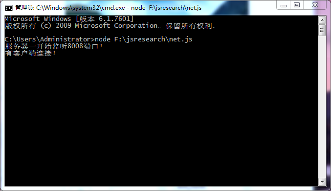

##### 前言
最近在公司多个项目同时开工，连更新博客的时间都没了。但是该做的还得做，不能找理由、找借口，今天就挤点时间出来写完一篇吧。今天要说的node模块可以一个大头戏：net。此模块可以很多其他模块的基础，稳定性和重要性不言而喻。

##### net.createServer([options], [connectionListener])
创建一个TCP服务器，此函数有2个可选参数：

+ options 第一个参数是一个配置项，只有一个配置（allowHalfOpen）。表示允许服务器保持半开连接。

+ connectionListener 第二个参数是连接触发的事件函数，只要有客户端连接上来，此事件就会被触发。

```js
// 创建一个服务器
var net = require('net');

var server = net.createServer(function(){
  console.log('有客户端连接！');
});

server.listen(8008, function(){
  console.log('服务器一开始监听8008端口！');
});
```

运行以上代码，就会开启本机8008端口的TCP监听，当有客户端连接上来就会打印指定字符串："有客户端连接！"（效果如下图）。



##### net.connect(options, [connectionListener])、net.createConnection(options, [connectionListener])
这2个方法是一个实现逻辑，其实就是一个方法，node源码是这么写的：

```js
exports.connect = exports.createConnection = function() {
  // ...
};
```

此方法就是作为客户端去连接一个服务器端。此方法有2个参数，第一个参数（options）同样是配置项，第二个参数是一个可选参数，表示连接建立后推送的事件。

+ options 此参数是一个配置项，并且是必须的。配置项包括：
  + port 连接到的端口
  + host 对方（服务器）的主机地址，默认是"localhost"
  + localAddress 需要绑定的本地接口
  + path 在UNIX机器上的套接字路径
  + allowHalfOpen 是否允许半连接

+ connectionListener 连接建立之后推送的事件

```js
// 创建一个服务器
var net = require('net');

var server = net.createServer(function(){
  console.log('有客户端连接！');
});

server.listen(8008, function(){
  console.log('服务器一开始监听8008端口！');
});
```

```js
// 创建一个客户端
var net = require('net');

net.connect({
  port: 8008
}, function(){
  console.log('已经连接到本机的8008端口');
});
```
分别运行上面的服务器和客户端代码，效果如下：


另外这个方法还有简单版本，不需要配置options。

```js
// 创建一个客户端
var net = require('net');

net.connect(8008, function(){
  console.log('已经连接到本机的8008端口');
});
```

或者

```js
// 创建一个客户端
var net = require('net');

net.connect('/root/c.sock', function(){
  console.log('已经连接到本机的8008端口');
});
```

##### net.Server
这是一个类，用来创建TCPserver（上面我们提到的net.createServer方法返回的就是一个net.Server实例）

#### server.listen(port, [host], [backlog], [callback])
开启接受连接。此方法有4个参数：

+ port 需要监听的端口，如果端口传入0的话，当前服务器会监听一个随机端口。
+ host 此参数是一个可选参数，如果不传此参数，当前服务器会接受所有IPV4的连接。
+ backlog 挂起连接的数量（默认值为511）
+ callback 监听开启回调函数（即listening事件）

```js
var Server = require('net').Server;
var tcpServer = new Server();

// 开启监听8800端口
tcpServer.listen(8800);

// 监听开启事件
tcpServer.on('listening', function(){
  console.log('监听服务已开启，端口：8800');
});
```

以上代码很简单，首先开启了8800端口的监听，然后定义了listening事件，一旦开启8800端口监听成功，就会推送listening事件。当然，server.listen方法还有很多用法：

##### server.listen(path, [callback])、server.listen(handle, [callback])

+ server.listen(path, [callback]) 表示连接一个UNIX套接字
+ server.listen(handle, [callback]) 表示根据传入的处理对象（server或者socket）进行连接

##### server.close([callback])
停止接受新的连接，但是此方法调用之后现有的连接会保持，直到所有的连接都断开并且服务器触发了'close'事件之后，server才会真正的关闭。

```js
var net  = require('net');
var server = new net.Server();

server.listen(8800);

server.on('listening', function() {
  console.log('started.');
});

setTimeout(function() {
  server.close(function() {
    console.log('closed.');
  });
}, 3000);
```

运行以上代码之后，如果3秒内没有连接，那么服务器会自动退出，否则会等待所有连接处理完毕，才会关闭服务器端。另外以上代码也可以这样写：

```js
var net  = require('net');
var server = new net.Server();

server.on('listening', function() {
  console.log('started.');
});

server.on('close', function() {
  console.log('closed.');
});

server.listen(8800);

setTimeout(function() {
  server.close();
}, 3000);
```

##### server.address()
此方法返回一个JSON数据，包括绑定的IP地址、IP类型、端口号。

```js
var net  = require('net');
var server = new net.Server();

server.on('listening', function() {
  console.log(server.address()); // { address: '0.0.0.0', family: 'IPv4', port: 8000 }
});

server.listen(8000);
```

注意，只有在服务器触发了'listening'事件之后，server.address方法才可以调用，否则此方法会返回null值：

```js
var net  = require('net');
var server = new net.Server();

console.log(server.address()); //  null
server.listen(8000);
```

##### server.unref()、server.ref()
server.unref方法会允许程序退出（在'事件系统'中只有当前服务器时）

```js
var net  = require('net');
var server = new net.Server();

server.listen(8000);
server.unref();
```

server.ref方法是server.unref的反操作，会阻止服务器退出（之前调用了server.unref）

```js
var net  = require('net');
var server = new net.Server();

server.listen(8000);
server.unref();

setTimeout(function() {
  server.ref();
}, 3000);
```

此时服务器不会因为调用了server.unref方法而退出。

##### server.getConnections(callback)
获取当前连接数。

```js
var net  = require('net');
var server = new net.Server();

server.on('listening', function() {
  console.log('server is listening.');
});

server.on('connection', function() {
  server.getConnections(function(err, count) {
    if(err) return;

    console.log('当前的连接数：%d', count);
  });
});

server.listen(8000);
```

##### net.Server的事件
net.Server的事件的事件有：'listening'、'connection'、'close'、'error'，所有的事件都在上面的代码中间接介绍了。

##### net.Socket
net.Socket是一个类，是TCP或UNIX套接字抽象。并且实现了复杂模式的Stream接口（关于Stream的更多信息，我会在以后的博客中介绍）。

##### new net.Socket([options])
创建一个socket实例，此方法有一个可选的配置参数：options，其中有4个属性可以配置

+ fd 指定socket文件描述符（默认值为null）
+ allowHalfOpen 是否允许半连接（默认值为false）
+ readable 是否可读（默认值为false）
+ writable 是否可写（默认值为false）

```js
var net = require('net');
var socket = new net.Socket({
  allowHalfOpen: true
});

socket.connect(8088);

socket.on('connect', function() {
  console.log('The socket is established.');
});

socket.on('error', function() {
  console.log('Something is wrong.');
});
```

##### socket.connect(port, [host], [connectListener])、socket.connect(path, [connectListener])
建立一个socket连接，并且可以指定端口、主机或者是连接文件。如果我们需要建立一个socket连接，可以这个干：

服务器端：

```js
var net = require('net');
var server = new net.Server();

server.listen(8088, function() {
  console.log('listening.');
});

server.on('connection', function(socket) {
  console.log('someone is in.');
});
```

在服务器端，我们需要创建一个net.Server实例，用来作为服务器等待连接。

客户端：

```js
var net = require('net');
var socket = new net.Socket({
  allowHalfOpen: true
});

socket.connect(8088);

socket.on('connect', function() {
  console.log('The socket is established.');
});

socket.on('error', function() {
  console.log('Something is wrong.');
});
```

在客户端我们利用net.connect方法连接上了我们刚刚创建的服务器实例，并且定义了'connect'事件（socket连接建立立即推送的事件）和'error'事件。如果连接建立成功，在服务器端就会打印出“listening.”和“someone is in.”，在客户端并打印“The socket is established.”。如果出现出错，客户端会触发'error'事件（打印“Something is wrong.”）。

##### socket.bufferSize
待写入字符大小

```js
var net = require('net');
var socket = new net.Socket({
  allowHalfOpen: true
});

socket.connect(8088);

socket.on('connect', function() {
  console.log('The socket is established.');
  console.log(socket.bufferSize); // 0
});
```

##### socket.setEncoding([encoding])
当socket被设置成可读时，此函数可用来设置Stream编码格式。

##### socket.write(data, [encoding], [callback])
使用socket发送数据，此函数有2个可选参数：

+ encoding 如果发送的数据为字符串，可以设置编码（默认为UTF-8）
+ callback 当数据全部被处理之后调用的回调

客户端：

```js
var net = require('net');
var socket = new net.Socket({
  allowHalfOpen: true
});

socket.connect(8088);

socket.on('connect', function() {
  console.log('The socket is established.');

  socket.write('Hello Socket', function() {
    console.log('done.');
  });
});
```

服务器端：

```js
var net = require('net');
var server = new net.Server();

server.listen(8088, function() {
  console.log('listening.');
});

server.on('connection', function(socket) {
  console.log('someone is in.');

  socket.on('data', function(data) {
    console.log(data); // Hello Socket
  });
});
```

##### socket.end([data], [encoding])
半关闭socket，如果传入了可选参数data，那么相当于调用了socket.write(data)

```js
var net = require('net');
var socket = new net.Socket({
  allowHalfOpen: true
});

socket.connect(8088);

socket.on('connect', function() {
  console.log('The socket is established.');

  socket.end('bye.');
});
```

##### socket.destroy()
调用此方法后，除了一些出错信息，其他一切I/O都不可进行（可以认为是客户端主动关闭连接）

```js
var net = require('net');
var socket = new net.Socket({
  allowHalfOpen: true
});

socket.connect(8088);

socket.on('error', function(err) {
  console.log('error:' + err.message); // error:This socket is closed.
});

socket.on('connect', function() {
  console.log('The socket is established.');

  socket.destroy();

  socket.write('Hello'); // 此数据将不被传输，因为连接已经关闭
});
```

##### socket.pause()、socket.resume()
暂停读取数据、回复读取数据

发送端代码：
```js
var net = require('net');
var socket = new net.Socket({
  allowHalfOpen: true
});

socket.connect(8088);

socket.on('error', function(err) {
  console.log('error:' + err.message);
});

socket.on('connect', function() {
  console.log('The socket is established.');

  setInterval(function(){
    socket.write(new Date() + 'Hello');
  }, 1000);
});
```

接收端代码：
```js
var net = require('net');
var server = new net.Server({
  allowHalfOpen: true
});

server.listen(8088, function() {
  console.log('listening.');
});

server.on('connection', function(socket) {
  console.log('someone is in.');

  socket.on('data', function(data) {
    console.log(data.toString());
  });

  socket.pause();

  setTimeout(function(){
    socket.resume();
  }, 1500);
});
```

##### socket.setTimeout(timeout, [callback])
设置socket超时，超时(指定时间)被触发之后，此socket将继续可用，我们必须手动调用socket.end或socket.destroy方法来中断连接

服务器端：
```js
var net = require('net');
var server = new net.Server({
  allowHalfOpen: true
});

server.listen(8088, function() {
  console.log('listening.');
});

server.on('connection', function(socket) {
  console.log('someone is in.');

  socket.on('data', function(data) {
    console.log(data.toString());
  });
});
```

客户端：
```js
var net = require('net');
var socket = new net.Socket({
  allowHalfOpen: true
});

socket.on('timeout', function() {
  console.log('timeout');

  socket.end('end');
});

socket.setTimeout(2000);
socket.connect(8088);
```

##### socket.setNoDelay([noDelay])
设置无延迟发送（关闭Nagle算法）。将数据立即发送出去，而无需使用Nagle算法。

##### socket.setKeepAlive([enable], [initialDelay])
开启心跳

+ enable 是否开启心跳（默认false）
+ initialDelay 心跳间隔

##### socket.address()、socket.unref()、socket.ref()
这3个方法与上面net.Server的3个方法类似，这里就不赘述

##### 其他属性

+ socket.remoteAddress 远程地址
+ socket.localAddress 本地地址
+ socket.remotePort 远程端口
+ socket.localPort 本地端口
+ socket.bytesRead 已接收字节数
+ socket.bytesWritten 已发送字节数

##### 事件'connect'、'data'、 'end'、'timeout'、'error'、'close'
 以上的事件都在上面的代码中使用过，已经熟悉了。而'drain'事件表示写入buffer为空时触发的事件（可用于上传逻辑）。

##### net.isIP(input)、net.isIPv4(input)、net.isIPv6(input)

+ net.isIP(input) 判断是否是IP地址（如果是IPV4就返回数字4，如果是IPV6就返回数字6，如果都不是则返回0）：

```js
var net = require('net');

console.log(net.isIP('172.16.0.90')); // 4
console.log(net.isIP('2001:0DB8:02de::0e13')); // 6
```

+ net.isIPv4(input) 判断是否是IPV4

```js
var net = require('net');

console.log(net.isIPv4('172.16.0.90')); // true
console.log(net.isIPv4('2001:0DB8:02de::0e13')); // false
```

+ net.isIPv6(input) 判断是否是IPV6

```js
var net = require('net');

console.log(net.isIPv6('172.16.0.90')); // false
console.log(net.isIPv6('2001:0DB8:02de::0e13')); // true
```

##### 总结
讲到这里，net模块就讲完了。其实与其他语言比较起来，使用node来做socket代码非常简洁并且天生异步的模式也非常符合生产环境使用。

##### 题外话
这边博客与上一篇间隔时间很长，大概有20多天的样子。期间忙于公司的事情与自我学习（主要是docker方向的），并且看到在[cnode](https://cnodejs.org/)已经有人在写关于node源码的文章了，所以我觉得关于node源码的部分我不全部讲解，只是在个别模块与注意点上写几篇跟人观点。
